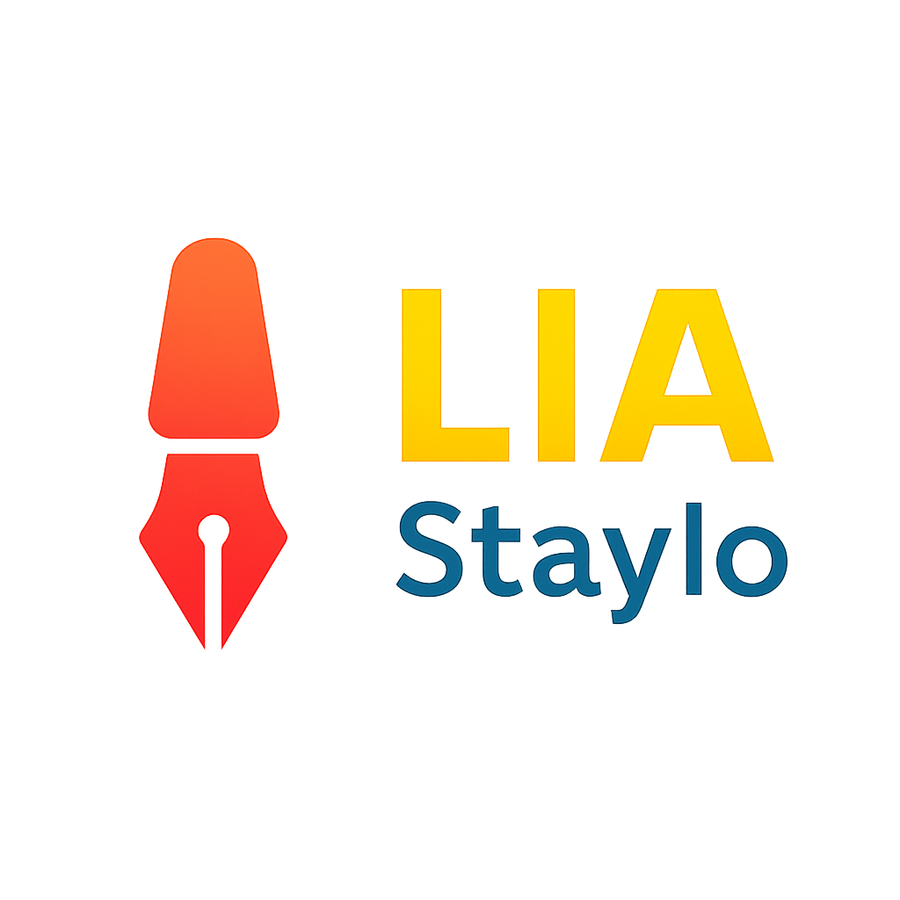

<!-- Encabezado centrado con logo -->
<p align="center">
  
</p>

<h1 align="center">✨ LIA-Staylo ✨</h1>
<p align="center">
  <b>Revisión profesional de estilo, gramática y ortografía para manuscritos y novelas.</b><br>
  Parte del ecosistema <a href="https://github.com/sagadeangelo/LIA-lectura-inmersiva-aumentada" target="_blank">LIA (Lectura Inmersiva Aumentada)</a>.
</p>

<p align="center">
  <a href="https://flutter.dev"></a>
  <a href="https://fastapi.tiangolo.com/"></a>
  <a href="https://languagetool.org/"></a>
  <a href="https://github.com/sagadeangelo/lia-staylo/releases"></a>
</p>

---

## 🧠 Descripción general

**LIA-Staylo** es un asistente inteligente de revisión literaria que utiliza **análisis lingüístico avanzado** para detectar y corregir errores en texto narrativo o técnico, cuidando la **coherencia estilística** del autor.  
Desarrollado con **Flutter (frontend)** y **FastAPI (backend)**, combina precisión gramatical con una interfaz moderna, limpia y profesional.

---

## 🌟 Funcionalidades principales

| Categoría | Descripción |
|------------|-------------|
| 🧩 **Análisis lingüístico avanzado** | Detección de errores de gramática, ortografía, puntuación, estilo y coherencia textual. |
| 🪶 **Asistencia de estilo con IA** | Genera sugerencias naturales basadas en el contexto narrativo. |
| ⚙️ **Corrección automática o manual** | Aplica mejoras globales o revisa selectivamente con control total. |
| 💾 **Gestión de proyectos (.lia)** | Guarda y reanuda sesiones con el mismo estado de análisis. |
| 🧮 **Panel de métricas visuales** | Contadores por categoría, íconos, resaltes y exportación directa a Word. |
| 🪟 **Diseño nativo para Windows** | Compilado como aplicación MSIX moderna con soporte FullTrust. |

---

# 🧱 Arquitectura del sistema

| Módulo                     | Contenido                                                                                      |
| -------------------------- | ---------------------------------------------------------------------------------------------- |
| **Frontend (Flutter)**     | `lib/screens` (Resultados, Sugerencias), `lib/services` (API), `lib/widgets` (UI), `main.dart` |
| **Backend (FastAPI)**      | `endpoints` (rutas), `dist/lia_backend.exe`                                                    |
| **LanguageTool (offline)** | Motor lingüístico embebido                                                                     |
| **assets**                 | Iconos, plantillas, recursos                                                                   |

---

## 🪄 Capturas de pantalla

| Vista | Descripción |
|:------|:-------------|
|  | Pantalla principal con panel de métricas y observaciones. |
|  | Resultados con filtros por tipo de error. |
|  | Aplicación automática de correcciones y sugerencias. |
|  | Vista final tras revisión completa. |

---

## 🚀 Instalación (modo desarrollador)

```bash
# 1. Clonar el repositorio
git clone https://github.com/sagadeangelo/lia-staylo.git
cd lia-staylo

# 2. Instalar dependencias
flutter pub get

# 3. Ejecutar en Windows
flutter run -d windows
💡 Requisitos:

Flutter 3.32.6 o superior

Dart 3.8+

Visual Studio Build Tools 2022

Python 3.10+ (solo si deseas reconstruir el backend)

💼 Compilación MSIX
Para crear el instalador moderno de Windows:

bash
Copy code
flutter pub run msix:create
El resultado se genera en dist_msix/LIA-Staylo.msix.

También puedes usar Inno Setup para crear un instalador clásico:

bash
Copy code
iscc setup_inno.iss
🔗 Ecosistema LIA
Proyecto	Descripción
🧠 LIA-Staylo	Revisión de estilo y gramática literaria.
🌍 LIA-Senz	Traducción y localización cultural avanzada.
🎧 LIA-Lectura Inmersiva Aumentada (LIA)	Motor de lectura inmersiva con voz, imágenes y efectos sincronizados.

🧰 Tecnologías empleadas
<p align="center">  </p>
Frontend: Flutter / Dart
Backend: FastAPI (Python)
Librerías principales: LanguageTool, docx_template, window_manager, file_selector
Distribución: MSIX / Inno Setup
IA (integración futura): Coqui TTS + SDXL

🧑‍💻 Contribución
¡Las contribuciones son bienvenidas! 💙

Haz un fork del repositorio.

Crea una rama para tu mejora:

bash
Copy code
git checkout -b feature/nueva-funcion
Realiza los cambios y haz commit:

bash
Copy code
git commit -m "feat: mejora de revisión ortográfica"
Envía un Pull Request a main.

🔍 Áreas abiertas a colaboración:

Refinamiento del motor lingüístico

Integración con IA generativa

Soporte multiidioma (es-MX, es-419, en-US)

📜 Licencia
Desarrollado por Miguel Tovar — Saga de Ángelo / Proyecto LIA
© 2025 Todos los derechos reservados.

Distribución con fines educativos y de demostración.
Para licencias comerciales o distribución, contacta:
📩 contacto@lasagadeangelo.com.mx
